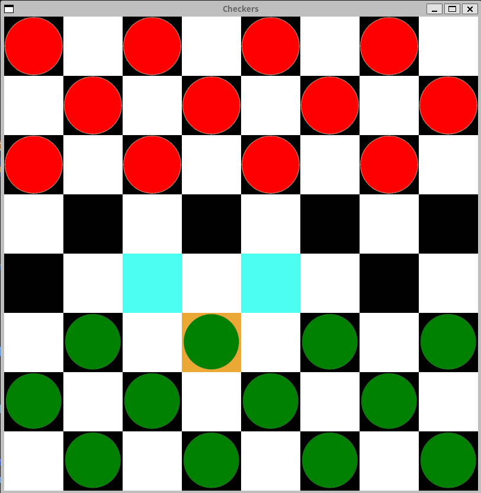

# Comparing functional programming in Go with Python
## Using the [Minimax](https://de.wikipedia.org/wiki/Minimax-Algorithmus) algorithm with the [Checkers](https://en.wikipedia.org/wiki/Checkers) board game as an example 

## Purpose
The purpose of this repository is to show how functional concepts can be implemented in the two languages Python and Go. Therefore, the same use case is implemented in both languages. 
The essay (which is also in this repository) aims firstly to introduce the basic concepts of functional programming. Second, how it can be implemented in Go or Python. Third, to compare these implementation techniques with each other.  

## Checkers Board Game
- a game for two players, one with red pieces, the other with green pieces

- The green player (you) moves first, then the players take turns. 

## Rules

- A move consists of moving a piece diagonally to an adjacent unoccupied square. 

- If there is an opponent's piece in the adjacent square and the square immediately behind it is vacant, the piece must be captured and removed from the game by jumping over it. After the smashing, the same player has the turn.

- If a player either has no pieces left or cannot move due to being blocked, he loses the game.

- If a player get to the opposite base line then he gets a Checker (Dame). 

- A Checker can go in every direction, whereas a normal piece can only go 
in one direction

## How to use this code 

In the subdirectories (Python and Go) there is another README file that explains how to run the code. 